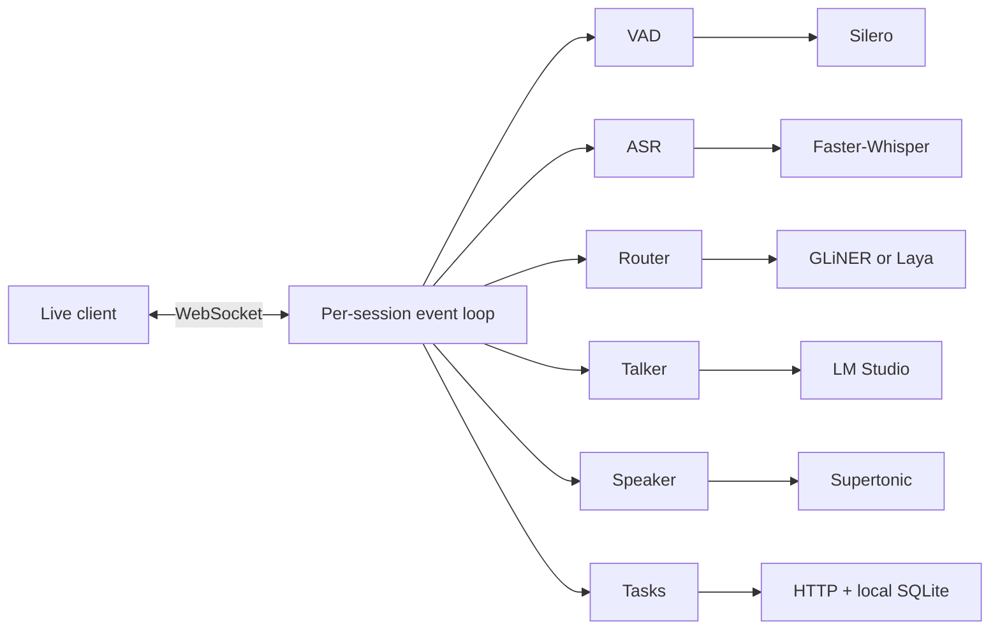

# open-gptlive-poc

A local GPT-Live voice server. You talk in the browser. The server transcribes you, decides whether to answer, and talks back.

Python 3.12 or newer. Day-to-day development is on 3.14. Keep the whole stack on one machine. The budget is under 6 GB of VRAM, though that depends on which models you load.

This is a proof of concept. It will break. Treat it that way.

## Run

Put secrets and model paths in an untracked `.env`. The process needs Silero VAD, Faster-Whisper, a System 1 router, and [LM Studio](https://lmstudio.ai) serving a chat model.

```env
GPTLIVE_SILERO_MODEL_PATH=/models/silero_vad.onnx
GPTLIVE_WHISPER_MODEL_PATH=/models/faster-whisper
GPTLIVE_GLINER_MODEL_PATH=/models/gliner2.5-decide-onnx
```

Start LM Studio, then:

```bash
uv run --env-file .env uvicorn --app-dir src open_gptlive_poc.server:app --host 127.0.0.1 --port 8000
```

Open <http://127.0.0.1:8000>, allow the microphone, and hit **Start talking**. The same button pauses and resumes the reply. **End conversation** closes the session. History stays until you start the next one.

If `GPTLIVE_BEARER_TOKEN` has a value, paste it under Connection settings. An empty token turns auth off. Bind to localhost when you do that.

The FastAPI app serves the page at `/`, the browser socket at `/ws/live`, and the API socket at `/v1/live/sessions`.

```bash
PYTHONPATH=src python3 -m unittest discover -s tests -v
```

## How a turn works



Audio in, VAD, Whisper, then the router. From there the session either asks LM Studio to talk, posts a background task, waits, or interrupts itself. Supertonic speaks the reply as 100 ms chunks of mono 24 kHz PCM16LE.

The session layer owns protocol and lifecycle. Adapters own the model libraries.

Sessions send `session.usage.updated` about once a minute and again on `session.closed`. They expire after `GPTLIVE_MAX_SESSION_DURATION_S` seconds, default 3600. Close reasons are `expired`, `close_requested`, and `connection_lost`. A close cancels speech that is still queued. Work already posted to the task URL keeps going.

## Router

Pick one System 1 provider per process. The default is the ONNX export of [GLiNER2.5-Decide](https://huggingface.co/nishparadox/gliner2.5-decide-onnx):

```env
GPTLIVE_ROUTER_PROVIDER=gliner
GPTLIVE_GLINER_MODEL_PATH=/models/gliner2.5-decide-onnx
```

For the multilingual Laya provider, install the `laya` extra and point at the tokenizer plus the ONNX graph:

```env
GPTLIVE_ROUTER_PROVIDER=laya
GPTLIVE_LAYA_MODEL_PATH=/models/laya-multilingual-onnx-int4
GPTLIVE_LAYA_SUBFOLDER=multilingual
GPTLIVE_LAYA_ONNX_PATH=/models/laya-multilingual-onnx-int4/laya-multilingual-int4-blk32.onnx
```

Laya uses typed `choice`, `score`, and `noul` questions and still returns `RouteDecision`. See the [Laya ONNX runtime](https://nandhakishorm.github.io/laya/reference/agent/) and the [multilingual ONNX export](https://huggingface.co/yehor-oleksiuk/laya-multilingual-onnx).

## LM Studio

The talker calls the OpenAI-compatible `/v1/chat/completions` endpoint. Set `GPTLIVE_LM_STUDIO_BASE_URL` to an `/api/v1` URL only when you want the native LM Studio API.

On `/v1` the session advertises two tools: `get_current_time` for local time and timezone, and `start_timer` for a reminder spoken when it fires. Timers die with the session.

Smoke-test streaming:

```bash
curl -N http://localhost:1234/v1/chat/completions \
  -H "Content-Type: application/json" \
  -d '{
    "model": "qwen3.5-2b-mtp-voodoo",
    "messages": [
      {"role": "system", "content": "You answer only in rhymes."},
      {"role": "user", "content": "What is your favorite color?"}
    ],
    "reasoning_effort": "none",
    "stream": true
  }'
```

## Speech

Supertonic pulls weights into the Hugging Face cache on first use. Live voice `marin` maps to style `F1`. Override with `GPTLIVE_SUPERTONIC_VOICE_MAP`, for example `{"marin":"F1","cedar":"M1"}`.

## Background tasks

The server POSTs work to `GPTLIVE_TASKS_URL`. Results come in on `POST /internal/delegations/{delegation_id}/result` with `{"content":"..."}`, using the same bearer token. The session registers the ID before that POST, so a fast callback already has a row waiting.

Several workers on one machine share a SQLite file through `GPTLIVE_DELEGATION_DB_PATH`. Default is `.gptlive-delegations.sqlite3` in the working directory. Keep that file on a local disk. Each result is consumed once. Unknown or closed IDs return 404.

## Logs

JSON goes to `.gptlive-logs/server.jsonl`, rotated at 10 MB and kept for seven days. The terminal prints warnings and errors. Set `GPTLIVE_CONSOLE_LOG_LEVEL=INFO` for routine lines, or `DEBUG` for audio-queue noise. `GPTLIVE_LOG_LEVEL` is the file. `GPTLIVE_LOG_FILE=` turns the file off.

Records carry `session_id` and `turn_id`. They skip audio, credentials, and transcript text.

When a turn never reaches the model, start with `Router decision`. The `talk`, `task`, `wait_for_user`, and `interrupt_current` fields say which branch ran. A model call should then log `Starting LM Studio reply`, `LLM first token received`, and TTS.

```bash
jq -c 'select(.record.message == "Router decision" or .record.message == "Starting LM Studio reply" or .record.message == "TTS synthesis started")' .gptlive-logs/server.jsonl
```

## Settings

Everything is a `GPTLIVE_*` environment variable. Required paths and tokens stay out of git.

| Variable | Role |
| --- | --- |
| `GPTLIVE_SILERO_MODEL_PATH` | Required. Silero VAD ONNX. |
| `GPTLIVE_WHISPER_MODEL_PATH` | Required. Faster-Whisper weights. |
| `GPTLIVE_GLINER_MODEL_PATH` | Required when the router is `gliner`. |
| `GPTLIVE_LAYA_MODEL_PATH`, `GPTLIVE_LAYA_ONNX_PATH` | Required when the router is `laya`. |
| `GPTLIVE_BEARER_TOKEN` | Optional. Empty means no auth. |
| `GPTLIVE_LM_STUDIO_BASE_URL` | Default `http://127.0.0.1:1234/v1`. |
| `GPTLIVE_LM_STUDIO_MODEL` | Default `local-model`. |
| `GPTLIVE_MAX_SESSION_DURATION_S` | Default `3600`. |
| `GPTLIVE_DELEGATION_DB_PATH` | Local SQLite file for task callbacks. |
