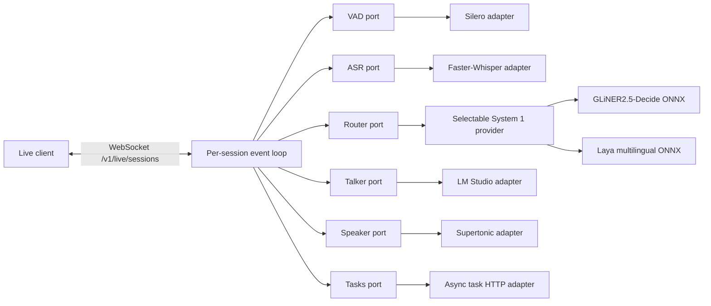
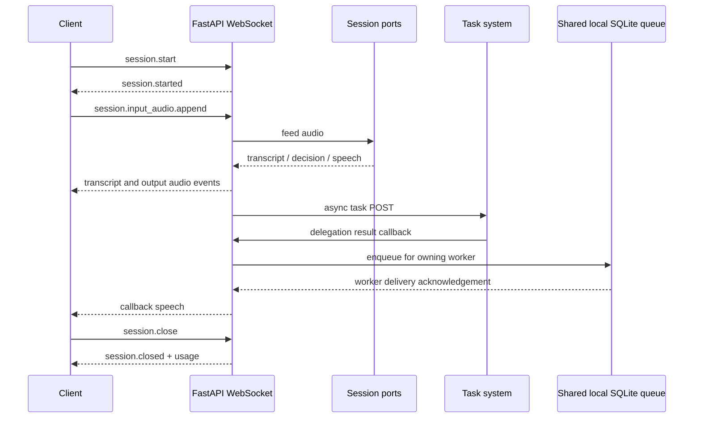

# open-gptlive-poc

Minimal GPT-Live 1 WebSocket server foundation.

The server exposes the Live event contract over WebSocket and keeps model
implementations behind replaceable ports. Python 3.14 is the local development
version; package compatibility starts at Python 3.12.

## High-level architecture



The session layer owns protocol and lifecycle state. Adapters own external
libraries and services; the session layer does not import model libraries.

## Session flow



Sessions report cumulative wall-clock time in `session.usage.updated` about
once per minute and repeat the final seconds in `session.closed`. The server
closes expired sessions with reason `expired`; configure the limit with
`GPTLIVE_MAX_SESSION_DURATION_S` (default `3600`). Explicit closes use
`close_requested`, and disconnected sockets use `connection_lost`. Closing a
session cancels current and queued speech but does not cancel tasks already
submitted to the external task system.

## Development

```bash
PYTHONPATH=src python3 -m unittest discover -s tests -v
```

Run the server and browser voice UI together (WebSocket support is included in
the project dependencies):

```bash
uv run --env-file .env uvicorn --app-dir src open_gptlive_poc.server:app --host 127.0.0.1 --port 8000
```

Open <http://127.0.0.1:8000> and choose **Start talking**. If
`GPTLIVE_BEARER_TOKEN` is set, enter that value under **Connection settings**;
if unset or empty, authentication is disabled and no token is needed. Keep the
server bound to localhost when running without a token. The page is served by
the same FastAPI app as `/v1/live/sessions`.

Configuration is loaded from `GPTLIVE_*` environment variables. Required
credentials and local model paths must remain outside the repository.

The server writes structured JSON logs by default to
`.gptlive-logs/server.jsonl` (rotated at 10 MB, retained for seven days). The
terminal shows warnings and errors only; set `GPTLIVE_CONSOLE_LOG_LEVEL=INFO`
to show concise routine logs, or `DEBUG` for audio-queue diagnostics. Set
`GPTLIVE_LOG_LEVEL=DEBUG` to include debug records in the file too. Set
`GPTLIVE_LOG_FILE` to change the path, or to an empty value to disable the file
sink. Logs correlate turns with `session_id` and `turn_id` and include VAD,
ASR, routing, LM Studio, TTS, and tool lifecycle events without recording
audio, credentials, or transcript contents.
To see why a turn did not reach the model, inspect `Router decision` first:
its `talk`, `task`, `wait_for_user`, and `interrupt_current` fields explain the
branch. A model call should then produce `Starting LM Studio reply`, followed
by `LLM first token received` and TTS lifecycle records. For example:

```bash
jq -c 'select(.record.message == "Router decision" or .record.message == "Starting LM Studio reply" or .record.message == "TTS synthesis started")' .gptlive-logs/server.jsonl
```

Set the required model paths in an untracked local `.env` file or in the
deployment environment. Do not add machine-specific paths to the repository.

The router uses one selectable System 1 decision provider per process. GLiNER
and Laya are alternatives, not sequential stages. The default is the ONNX
export of [GLiNER2.5-Decide](https://huggingface.co/nishparadox/gliner2.5-decide-onnx):

```env
GPTLIVE_ROUTER_PROVIDER=gliner
GPTLIVE_GLINER_MODEL_PATH=/models/gliner2.5-decide-onnx
```

To evaluate or run the multilingual Laya provider instead, install the ONNX
extra and configure the original Laya tokenizer/configuration plus its ONNX
graph:

```env
GPTLIVE_ROUTER_PROVIDER=laya
GPTLIVE_LAYA_MODEL_PATH=/models/laya-multilingual-onnx-int4
GPTLIVE_LAYA_SUBFOLDER=multilingual
GPTLIVE_LAYA_ONNX_PATH=/models/laya-multilingual-onnx-int4/laya-multilingual-int4-blk32.onnx
```

Laya uses typed `choice`, `score`, and `noul` questions and returns the same
`RouteDecision` interface as GLiNER. Keep model downloads outside the
repository; model paths and Hub IDs are configuration only. See the
[Laya ONNX runtime](https://nandhakishorm.github.io/laya/reference/agent/)
and [multilingual ONNX export](https://huggingface.co/yehor-oleksiuk/laya-multilingual-onnx).

LM Studio uses the OpenAI-compatible `/v1/chat/completions` endpoint by
default. Set `GPTLIVE_LM_STUDIO_BASE_URL` to `/api/v1` only when using the
native LM Studio API. Session replies advertise two real function tools to
models that support OpenAI-compatible tool calls: `get_current_time` returns
the server's local time with timezone, and `start_timer` schedules a
session-scoped reminder that is spoken when it completes. These tools require
the `/v1` API; timers are canceled when the live session closes.

Supertonic supplies speech output. Its Python package downloads model files to
the Hugging Face cache on first use. The Live voice `marin` maps to Supertonic
style `F1`; override voice/style mappings with
`GPTLIVE_SUPERTONIC_VOICE_MAP`, for example
`{"marin":"F1","cedar":"M1"}`. Audio is resampled to mono 24 kHz PCM16LE
and emitted as 100 ms deltas. The authenticated task callback endpoint accepts
`POST /internal/delegations/{delegation_id}/result` with `{"content":"..."}`.
Delegation IDs are registered before the task POST, so a fast callback cannot
arrive before the live session knows the ID. For multiple workers on one
machine, callback ownership and results are relayed through SQLite. All workers
must use the same `GPTLIVE_DELEGATION_DB_PATH` on a local filesystem; do not put
the database on a network share. The default is `.gptlive-delegations.sqlite3`
in the current working directory. Callback rows are consumed once, and unknown
or closed delegation IDs return 404. The result callback is authenticated with
the configured bearer token.

Test OpenAI-compatible streaming directly:

```bash
curl -N http://localhost:1234/v1/chat/completions \
  -H "Content-Type: application/json" \
  -d '{
    "model": "qwen3.5-2b-mtp-voodoo",
    "messages": [
      {"role": "system", "content": "You answer only in rhymes."},
      {"role": "user", "content": "What is your favorite color?"}
    ],
    "reasoning_effort": "none",
    "stream": true
  }'
```
