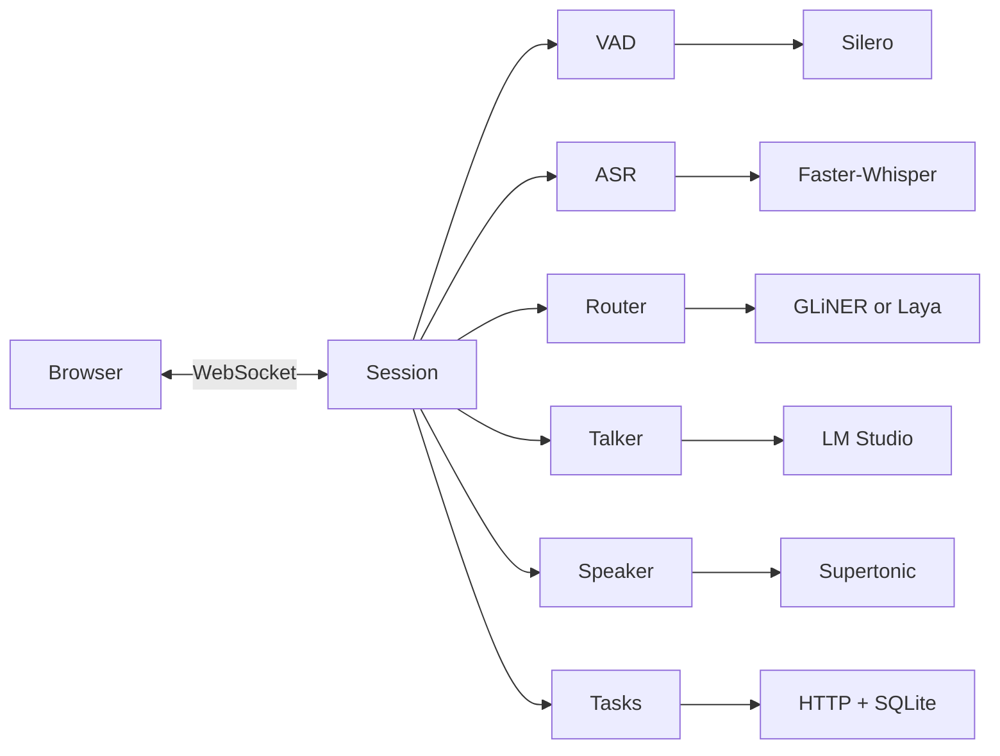

# open-gptlive-poc

A local GPT-Live voice assistant. You talk in the browser. The server hears you, decides if it should answer, and talks back.

> It is a proof of concept. Run it on one machine. Expect bugs. Aim for under 6 GB of VRAM, depending on the models you load.

## What you get

- 🎤 **Live voice in the browser.** Mic in, speech out. Pause and resume from the same button.
- ⚡ **GPT-Live events over WebSocket.** Browser socket at `/ws/live`, API socket at `/v1/live/sessions`.
- 🧠 **A small router before the LLM.** GLiNER by default, Laya if you want multilingual. Talk, wait, interrupt, or kick off a task.
- 👂 **Local speech in.** Silero VAD, then Faster-Whisper.
- 🗣️ **Local speech out.** Supertonic, 100 ms chunks of 24 kHz mono PCM16.
- 💬 **LM Studio for replies.** OpenAI-style chat, plus `get_current_time` and `start_timer`.
- 📬 **Background tasks.** POST work out, get a spoken result when it comes back.
- 📋 **Turn logs.** `session_id` and `turn_id` in JSON. No audio, tokens, or transcripts in the file.


## Run

Put model paths in an untracked `.env`. You need Silero, Faster-Whisper, a router, and [LM Studio](https://lmstudio.ai) serving a chat model.

```env
GPTLIVE_SILERO_MODEL_PATH=/models/silero_vad.onnx
GPTLIVE_WHISPER_MODEL_PATH=/models/faster-whisper
GPTLIVE_GLINER_MODEL_PATH=/models/gliner2.5-decide-onnx
```

1. Start LM Studio.
2. Start the server:

```bash
uv run --env-file .env uvicorn --app-dir src open_gptlive_poc.server:app --host 127.0.0.1 --port 8000
```

3. Open <http://127.0.0.1:8000>, allow the mic, click **Start talking**.
4. Click the same button to pause. **End conversation** hangs up. History stays until the next session.

If `GPTLIVE_BEARER_TOKEN` is set, paste it under Connection settings. Empty token means no auth. Bind to localhost then.

```bash
PYTHONPATH=src python3 -m unittest discover -s tests -v
```

## How a turn flows



Audio hits VAD, then Whisper, then the router. The router picks a branch. Session code owns the protocol. Adapters load the models.

- Usage ticks about once a minute in `session.usage.updated`, then again in `session.closed`.
- Max length is `GPTLIVE_MAX_SESSION_DURATION_S`, default 3600 seconds.
- Close reasons: `expired`, `close_requested`, `connection_lost`.
- Closing stops speech. Tasks already sent keep running.

## Router

One router per process.

**GLiNER** is the default. Use the ONNX export of [GLiNER2.5-Decide](https://huggingface.co/nishparadox/gliner2.5-decide-onnx):

```env
GPTLIVE_ROUTER_PROVIDER=gliner
GPTLIVE_GLINER_MODEL_PATH=/models/gliner2.5-decide-onnx
```

**Laya** is the multilingual option. Install the `laya` extra, then:

```env
GPTLIVE_ROUTER_PROVIDER=laya
GPTLIVE_LAYA_MODEL_PATH=/models/laya-multilingual-onnx-int4
GPTLIVE_LAYA_SUBFOLDER=multilingual
GPTLIVE_LAYA_ONNX_PATH=/models/laya-multilingual-onnx-int4/laya-multilingual-int4-blk32.onnx
```

Laya asks `choice`, `score`, and `noul` questions and still returns `RouteDecision`. [Runtime docs](https://nandhakishorm.github.io/laya/reference/agent/). [ONNX export](https://huggingface.co/yehor-oleksiuk/laya-multilingual-onnx).

## LM Studio

Talker uses OpenAI `/v1/chat/completions`. Set `GPTLIVE_LM_STUDIO_BASE_URL` to an `/api/v1` URL for LM Studio's own API.

Tools on `/v1`:

- `get_current_time`: local time and timezone
- `start_timer`: spoken when it fires, stopped when the session closes


## Speech

First run downloads Supertonic into the Hugging Face cache.

- Live voice `marin` maps to style `F1`
- Override with `GPTLIVE_SUPERTONIC_VOICE_MAP`, like `{"marin":"F1","cedar":"M1"}`

## Tasks

The server POSTs to `GPTLIVE_TASKS_URL`. Results come back on `POST /internal/delegations/{delegation_id}/result` as `{"content":"..."}`, with the bearer token. The ID is stored before the POST.

- Share `GPTLIVE_DELEGATION_DB_PATH` across workers on the same machine
- Default file: `.gptlive-delegations.sqlite3`
- Keep it on local disk
- Each result is used once
- Unknown IDs return 404

## Logs

JSON goes to `.gptlive-logs/server.jsonl`. Rotates at 10 MB. Kept 7 days. The terminal shows warnings and errors.

- `GPTLIVE_CONSOLE_LOG_LEVEL=INFO` for normal lines
- `DEBUG` for the audio queue
- `GPTLIVE_LOG_LEVEL` for the file
- `GPTLIVE_LOG_FILE=` to turn the file off

If the model never runs, start with `Router decision`. Check `talk`, `task`, `wait_for_user`, `interrupt_current`. Next you should see `Starting LM Studio reply`, then `LLM first token received`, then TTS.

```bash
jq -c 'select(.record.message == "Router decision" or .record.message == "Starting LM Studio reply" or .record.message == "TTS synthesis started")' .gptlive-logs/server.jsonl
```

## Settings

All config is `GPTLIVE_*`. Keep paths and tokens out of git.

| Variable | Role |
| --- | --- |
| `GPTLIVE_SILERO_MODEL_PATH` | Required. Silero VAD. |
| `GPTLIVE_WHISPER_MODEL_PATH` | Required. Faster-Whisper. |
| `GPTLIVE_GLINER_MODEL_PATH` | Required for GLiNER. |
| `GPTLIVE_LAYA_MODEL_PATH`, `GPTLIVE_LAYA_ONNX_PATH` | Required for Laya. |
| `GPTLIVE_BEARER_TOKEN` | Optional. Empty means no auth. |
| `GPTLIVE_LM_STUDIO_BASE_URL` | Default `http://127.0.0.1:1234/v1`. |
| `GPTLIVE_LM_STUDIO_MODEL` | Default `local-model`. |
| `GPTLIVE_MAX_SESSION_DURATION_S` | Default `3600`. |
| `GPTLIVE_DELEGATION_DB_PATH` | SQLite file for task callbacks. |
