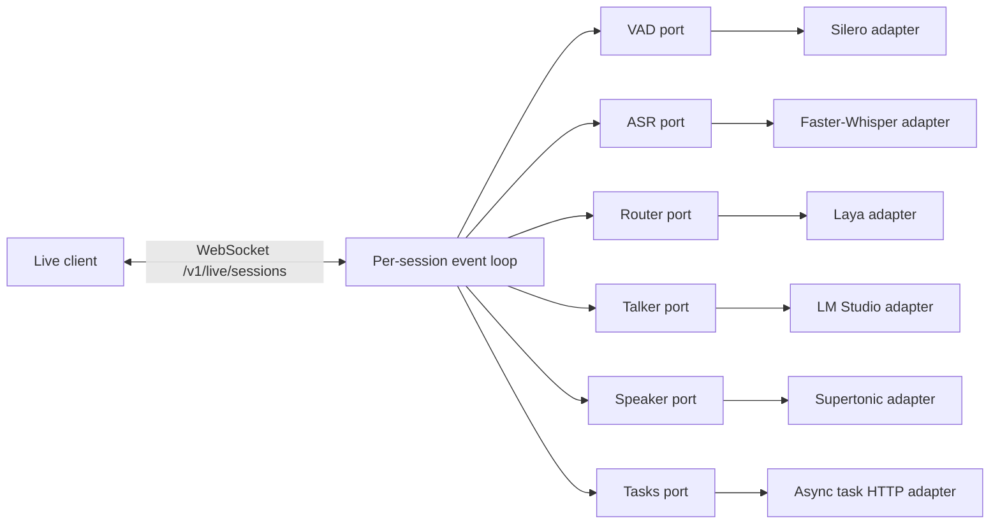
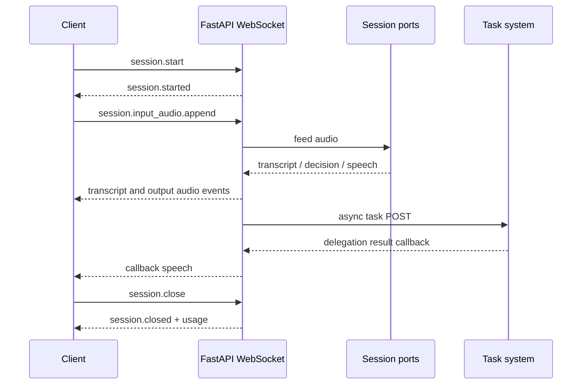

# open-gptlive-poc

Minimal GPT-Live 1 WebSocket server foundation.

The server exposes the Live event contract over WebSocket and keeps model
implementations behind replaceable ports. Python 3.14 is the local development
version; package compatibility starts at Python 3.12.

## High-level architecture



The session layer owns protocol and lifecycle state. Adapters own external
libraries and services; the session layer does not import model libraries.

## Session flow



## Development

```bash
PYTHONPATH=src python3 -m unittest discover -s tests -v
```

Configuration is loaded from `GPTLIVE_*` environment variables. Required
credentials and local model paths must remain outside the repository.

Example local model configuration:

```bash
export GPTLIVE_SILERO_MODEL_PATH=/home/ali/Models/silero_vad.onnx
export GPTLIVE_WHISPER_MODEL_PATH=/home/ali/Models/hub/models--deepdml--faster-whisper-large-v3-turbo-ct2/snapshots/4df90f75321148c3a29a9e2351b7ddf8f5b115a8
```
